# Tools Desktop Documentation

Welcome to the documentation for **Tools Desktop** (`tools-desktop-tauri`), the desktop companion and hub within the **Tools** ecosystem.

"Tools" is an ever-evolving collection of cross-device utilities that seamlessly bridge PCs and mobile devices over local communication channels (Bluetooth and WebSocket) without relying on any external cloud infrastructure.

---

## Ecosystem Overview

The Tools ecosystem is built around local-first connectivity, peer-to-peer data synchronization, and modular capabilities:

```mermaid
graph LR
    subgraph Desktop ["Tools Desktop (Tauri + Rust)"]
        D_Bridge["Bridge Manager"]
        D_Storage["SQLite + Postcard Storage"]
        D_Clip["Clipboard Daemon"]
        D_Notes["Notes Manager"]
    end

    subgraph Transport ["Local Transport Layer"]
        BT["Bluetooth RFCOMM (BlueZ)"]
        WS["WebSocket (Local LAN)"]
    end

    subgraph Mobile ["Tools Mobile (React Native / Expo)"]
        M_Bridge["Bridge Manager"]
        M_DB["WatermelonDB (SQLite)"]
        M_Clip["Clipboard Sync"]
        M_Notes["Notes Provider"]
    end

    Desktop <--> Transport
    Transport <--> Mobile
```

---

## Documentation Index

### 1. Vision & Architecture
- [Vision & Roadmap](./vision-and-roadmap.md): The philosophy, multi-device direction, and phased roadmap (Core Trio, Remote Control, Mirroring, Command Runner, Local Mesh).
- [System Architecture](./system-architecture.md): Tauri v2 configuration, Hyprland window rules, Rust subsystems, Postcard/SQLite storage, and React frontend.
- [Bridge Protocol Specification](./bridge-protocol.md): Detailed specification of the wire protocol, binary framing headers, QR code advertisement, handshake lifecycle, and session resumption tokens.

### 2. Modular Tools
- [Notes Tool](./tools/notes.md): BlockNote-based rich-text notes, postcard serialization, masonry grid, and syncing contracts.
- [Clipboard Tool](./tools/clipboard.md): Real-time clipboard synchronization daemon powered by `arboard`, change detection, and bridge broadcasting.
- [File Transfer Tool](./tools/file-transfer.md): Cross-device binary file transfer protocol (`FileRequest`/`FileResponse`) and chunking.
- [Future Tools Roadmap](./tools/future-tools.md): Remote touchpad/keyboard, media playback control, notification mirroring, remote script execution, and local mesh relay.

### 3. Developer & Contributor Guides
- [Development Setup & Workflow](./guides/development.md): Prerequisites, build scripts, debugging Bluetooth/WebSocket, and local development.
- [Adding a New Tool](./guides/adding-a-tool.md): Step-by-step tutorial on implementing a new tool capability end-to-end in Desktop.

---

## Related Repositories

- **Tools Mobile**: [`tools-react-native`](../../tools-react-native/README.md) (Companion mobile app built with Expo and React Native)
