# Tools Bridge Protocol Specification

The **Tools Bridge Protocol** is a lightweight, local-first framing and messaging protocol enabling bi-directional communication between desktop workstations and mobile companions over heterogeneous transports (Bluetooth RFCOMM and WebSockets).

---

## Protocol Architecture

```mermaid
sequenceDiagram
    autonumber
    participant Desktop as Desktop (Hub / Server)
    participant Mobile as Mobile (Initiator / Client)

    Note over Desktop: Start WS Server & BlueZ RFCOMM Profile
    Desktop->>Desktop: Generate Advertisement Payload
    Desktop->>Mobile: Display QR Code (User Scans)
    
    Mobile->>Desktop: Connect (Transport: BT RFCOMM or WS)
    Mobile->>Desktop: Frame: Handshake [0x01] (Device info, capabilities)
    Desktop->>Mobile: Frame: HandshakeAck [0x03] (accepted=0x01, token=10 bytes)
    Note over Desktop,Mobile: Bridge Established (Ready for Packets & Streams)

    rect rgb(20, 30, 45)
    Note over Desktop,Mobile: Control Plane (DataType::Packet 0x06)
    Mobile->>Desktop: Frame: Packet (JSON: Clipboard, FileRequest, etc.)
    Desktop->>Mobile: Frame: Packet (JSON: FileResponse, Text, Ping, etc.)
    end

    rect rgb(25, 40, 30)
    Note over Desktop,Mobile: CRDT Sync Plane (DataType::AutomergeSync 0x08)
    Mobile->>Desktop: AutomergeSync Frame [0x08][u16 len][id][binary msg]
    Desktop->>Mobile: AutomergeSync Frame (Deltas & Sibling Relays)
    end

    rect rgb(40, 25, 30)
    Note over Desktop,Mobile: Data Plane (DataType::FileChunk 0x07 & ChunkAck 0x09)
    Desktop->>Mobile: FileChunk [0x07] (41B Header + Raw File Bytes)
    Mobile->>Desktop: ChunkAck [0x09] (28B Window Credit Feedback)
    end

    Note over Desktop,Mobile: Network Interruption / Reconnection
    Mobile->>Desktop: Reconnect
    Mobile->>Desktop: Frame: Reconnection [0x02] (token=10 bytes)
    Desktop->>Mobile: Frame: ReconnectionAck [0x04] (accepted=0x01, new_token=10 bytes)
    Desktop->>Mobile: Active-First Sync & Pending Message Replay
```



---

## 1. Discovery and Advertisement

The desktop initiates pairing by rendering a QR code containing an `Advertisement` JSON payload:

```json
{
  "device": {
    "name": "kyete-desktop",
    "alias": "Studio PC",
    "device_type": "desktop"
  },
  "capabilities": ["text", "websocket", "bluetooth", "notes_crdt", "file_streaming"],
  "connection_details": {
    "bluetooth_address": "XX:XX:XX:XX:XX:XX",
    "websocket_url": "ws://192.168.1.150:8080"
  },
  "protocol_version": "2.0"
}
```

---

## 2. Outer Framing & Canonical DataType Enum

All frames transmitted over Bluetooth RFCOMM and raw sockets begin with the Protocol v2 7-byte framing header:

```
+--------------------+-------------------+-----------------------+
| Magic (2B, 0x424D) | Version (1B, 0x02)| Length (4B, Little-End)|
+--------------------+-------------------+-----------------------+
```

Immediately following the outer header, byte `0x00` is the canonical **DataType** byte:

| Hex Code | Name | Plane | Description |
|---|---|---|---|
| `0x01` | `Handshake` | Control | Sent by client to introduce device specifications upon initial connection. |
| `0x02` | `Reconnection` | Control | Sent by client reconnecting with an existing session token. |
| `0x03` | `HandshakeAck` | Control | Sent by desktop acknowledging pairing and delivering a session token. |
| `0x04` | `ReconnectionAck`| Control | Sent by desktop confirming session resumption and rotating token. |
| `0x05` | `Disconnection` | Control | Sent to cleanly terminate a session. |
| `0x06` | `Packet` | Control | UTF-8 JSON application control envelope (Clipboard, FileRequest, etc.). |
| `0x07` | `FileChunk` | Data | 41-byte structured binary chunk header + raw binary file slice. |
| `0x08` | `AutomergeSync` | Sync | Compact binary CRDT synchronization message for rich-text notes. |
| `0x09` | `ChunkAck` | Data | 28-byte sliding-window flow control feedback frame. |

---

## 3. Specialized Binary Wire Layouts

### 3.1. AutomergeSync Frame (`0x08`)
```
Offset  Size (B)  Field            Type / Description
-----------------------------------------------------------------------------------
0x00    1         DataType         0x08 (AutomergeSync)
0x01    2         note_id_len      u16 Big-Endian (length N of note UUID string)
0x03    N         note_id          UTF-8 note UUID string (N bytes)
0x03+N  M         sync_message     Raw binary Automerge sync state bytes (M bytes)
```

### 3.2. FileChunk Frame (`0x07`)
```
Offset  Size (B)  Field            Type / Description
-----------------------------------------------------------------------------------
0x00    1         DataType         0x07 (FileChunk)
0x01    16        transfer_id      16-byte raw UUID (128-bit)
0x11    4         chunk_index      u32 Little-Endian (0-based chunk sequence index)
0x15    4         total_chunks     u32 Little-Endian (total chunk count for transfer)
0x19    8         offset           u64 Little-Endian (byte offset within destination)
0x21    4         payload_length   u32 Little-Endian (byte length K of this chunk)
0x25    1         flags            u8 bitfield: 0x01=EOF, 0x02=ACK_REQ, 0x04=RESUMED
0x26    4         checksum         u32 Little-Endian (IEEE CRC-32 of payload_bytes)
0x2A    K         payload_bytes    Raw binary file content (K bytes)
```

### 3.3. ChunkAck Frame (`0x09`)
```
Offset  Size (B)  Field            Type / Description
-----------------------------------------------------------------------------------
0x00    1         DataType         0x09 (ChunkAck)
0x01    16        transfer_id      16-byte raw UUID (128-bit)
0x11    4         cumulative_index u32 Little-Endian (highest contiguous chunk received)
0x15    4         window_credit    u32 Little-Endian (number of chunks sender may send)
0x19    1         status           0x00=OK, 0x01=CRC_FAIL, 0x02=IO_ERROR
0x1A    4         nack_chunk_index u32 Little-Endian (failed chunk index if status != 0)
```

---

## 4. Sliding-Window Flow Control

To prevent buffer overflows on Bluetooth RFCOMM serial links and buffer bloat on WebSockets:
- **Bluetooth RFCOMM**: Window size $W = 8$ (32 KB to 64 KB in-flight). Chunk size: 4 KB to 8 KB.
- **WebSocket (LAN)**: Window size $W = 32$ (2 MB in-flight). Chunk size: 64 KB to 128 KB.
- **Credit Replenishment**: Receiver transmits `ChunkAck` replenishing credit whenever available credit drops to $\le W / 2$.
