# Tools Bridge Protocol Specification

The **Tools Bridge Protocol** is a lightweight, local-first framing and messaging protocol enabling bi-directional communication between desktop workstations and mobile clients over heterogeneous transports (Bluetooth RFCOMM and WebSocket).

---

## Protocol Architecture

```mermaid
sequenceDiagram
    autonumber
    participant Desktop as Desktop (Hub / Server)
    participant Mobile as Mobile (Initiator / Client)

    Note over Desktop: Start WS Server & BlueZ RFCOMM Profile
    Desktop->>Desktop: Generate Advertisement Payload
    Desktop->>Mobile: Display QR Code (User Scans)
    
    Mobile->>Desktop: Connect (Transport: BT RFCOMM or WS)
    Mobile->>Desktop: Frame: Handshake (Device info, capabilities)
    Desktop->>Mobile: Frame: HandshakeAck (accepted=0x01, token=10 bytes)
    Note over Desktop,Mobile: Bridge Established (Ready for Packets)

    rect rgb(20, 30, 45)
    Note over Desktop,Mobile: Data Exchange
    Mobile->>Desktop: Frame: Packet (JSON Payload: Clipboard, Note, File, etc.)
    Desktop->>Mobile: Frame: Packet (JSON Payload: Ping, Pong, Text, etc.)
    end

    Note over Desktop,Mobile: Network Interruption / Reconnection
    Mobile->>Desktop: Reconnect
    Mobile->>Desktop: Frame: Reconnection (token=10 bytes)
    Desktop->>Mobile: Frame: ReconnectionAck (accepted=0x01, new_token=10 bytes)
    Desktop->>Mobile: Resend Pending Unsent Packets
```



---

## 1. Discovery and Advertisement

The desktop initiates pairing by rendering a high-density QR code containing an [`Advertisement`](file:///home/kyete/kitchen/tools-ws/workspaces/main/tools-desktop-tauri/src-tauri/src/bridge/packets.rs#L54-L59) JSON payload:

```json
{
  "device": {
    "name": "kyete-desktop",
    "device_type": "desktop"
  },
  "capabilities": ["text", "websocket", "bluetooth"],
  "connection_details": {
    "bluetooth_address": "XX:XX:XX:XX:XX:XX",
    "websocket_url": "ws://192.168.1.150:8080"
  },
  "protocol_version": "1.0"
}
```

### Discovery Fields
| Field | Type | Description |
|---|---|---|
| `device.name` | `string` | Human-readable hostname of the machine. |
| `device.device_type` | `string` | Device category (`"desktop"`, `"phone"`). |
| `capabilities` | `string[]` | List of supported features and transports. |
| `connection_details.bluetooth_address` | `string \| null` | BlueZ adapter MAC address for RFCOMM pairing. |
| `connection_details.websocket_url` | `string \| null` | Local LAN WebSocket URI for low-latency streaming. |
| `protocol_version` | `string` | Version of the wire protocol (currently `"1.0"`). |

---

## 2. Binary Framing & DataType Headers

All frames transmitted over the transport begin with a **1-byte DataType identifier**:

```
+-------------------+--------------------------------------------+
| DataType (1 byte) | Frame Data (variable length)               |
+-------------------+--------------------------------------------+
```

### Frame Types ([`DataType`](file:///home/kyete/kitchen/tools-ws/workspaces/main/tools-desktop-tauri/src-tauri/src/bridge/connection/bin_data.rs#L10-L18))
| Hex Code | Name | Description |
|---|---|---|
| `0x00` | `Handshake` | Sent by client to introduce device specifications upon initial connection. |
| `0x01` | `HandshakeAck` | Sent by desktop acknowledging pairing and delivering a session token. |
| `0x02` | `Disconnection` | Sent to cleanly terminate a session. |
| `0x03` | `Reconnection` | Sent by client reconnecting with an existing session token. |
| `0x04` | `ReconnectionAck`| Sent by desktop confirming session resumption and rotating token. |
| `0x05` | `Packet` | High-level application message payload (UTF-8 JSON string). |

---

## 3. Handshake & Reconnection Wire Layouts

### Handshake Frame (`0x00`)
```
Offset  Size  Field              Type / Description
-----------------------------------------------------------
0x00    1     DataType           0x00 (Handshake)
0x01    1     device_type        0x01 = Phone, 0x02 = PC
0x02    2     device_name_len    u16 (Big-Endian)
0x04    N     device_name        UTF-8 string (device_name_len bytes)
```

### HandshakeAck Frame (`0x01`)
```
Offset  Size  Field              Type / Description
-----------------------------------------------------------
0x00    1     DataType           0x01 (HandshakeAck)
0x01    1     accepted           0x01 = Approved, 0x00 = Rejected
0x02    10    reconnection_token 10-byte cryptographic session token
```

### Reconnection Frame (`0x03`)
```
Offset  Size  Field              Type / Description
-----------------------------------------------------------
0x00    1     DataType           0x03 (Reconnection)
0x01    10    token              10-byte session token from previous ACK
```

### ReconnectionAck Frame (`0x04`)
```
Offset  Size  Field              Type / Description
-----------------------------------------------------------
0x00    1     DataType           0x04 (ReconnectionAck)
0x01    1     accepted           0x01 = Resumed, 0x00 = Invalid/Expired
0x02    10    token              New 10-byte rotated token (if accepted)
```

---

## 4. Application Packet Schema (`DataType::Packet`)

When `DataType == 0x05`, the remaining bytes represent a UTF-8 JSON [`Packet`](file:///home/kyete/kitchen/tools-ws/workspaces/main/tools-desktop-tauri/src-tauri/src/bridge/packets.rs#L78-L83) structure.

### Packet Envelope
```json
{
  "timestamp": 1727900000,
  "type": "<PayloadType>",
  "payload": { ... }
}
```

### Supported Payloads

#### 1. Clipboard Sync (`Payload::Clipboard`)
Synchronizes clipboard plain text or formatted contents between devices.
```json
{
  "type": "Clipboard",
  "payload": {
    "content": "Text copied on desktop"
  }
}
```

#### 2. Text Message (`Payload::Text`)
Direct text payload used for conversational messaging or lightweight updates.
```json
{
  "type": "Text",
  "payload": {
    "content": "Hello from mobile!"
  }
}
```

#### 3. Heartbeat (`Payload::Ping` & `Payload::Pong`)
Connection liveness check.
```json
{ "type": "Ping" }
{ "type": "Pong" }
```

#### 4. File Transfer Request (`Payload::FileRequest`)
Initiates a binary file transfer across the link.
```json
{
  "type": "FileRequest",
  "payload": {
    "file_name": "photo.jpg",
    "file_size": 2048500,
    "mime_type": "image/jpeg",
    "transfer_mode": "stream",
    "transfer_id": "tx-8f92b"
  }
}
```

#### 5. File Transfer Response (`Payload::FileResponse`)
Accepts or denies a pending file transfer.
```json
{
  "type": "FileResponse",
  "payload": {
    "transfer_id": "tx-8f92b",
    "accepted": true,
    "message": "Ready to receive"
  }
}
```

#### 6. Error Notice (`Payload::Error`)
Reports protocol-level or payload processing errors.
```json
{
  "type": "Error",
  "payload": {
    "code": "invalid-format",
    "context": "PacketParser",
    "message": "Unknown data format received"
  }
}
```

---

## 5. Message Reliability & Queueing

In real-world usage, local Wi-Fi signals drop or mobile devices suspend network interfaces when screens lock.

The Tools Bridge implements **pending message persistence**:
1. All outgoing messages are stored with `sent = false` in a local `SavedPacket` queue.
2. Upon connection drop, unsent messages remain queued in SQLite.
3. Once the client issues a successful `Reconnection` with its valid 10-byte token, the desktop triggers `resend_pending_messages()`, replaying all unsent text and clipboard updates in chronological order.
