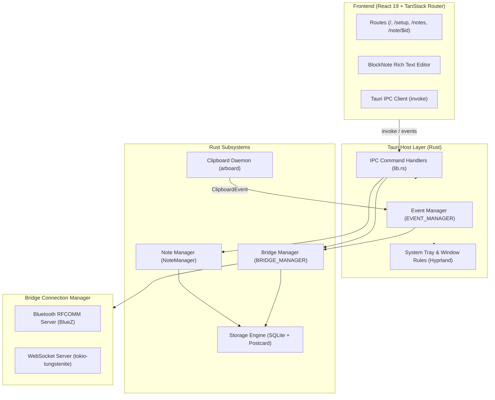

# Tools Desktop System Architecture

The desktop application (`tools-desktop-tauri`) serves as the workstation hub of the Tools ecosystem. It is built as a hybrid **Tauri v2** application, combining a high-performance **Rust** systems layer with a modern **React 19** user interface.

---

## High-Level Architecture

---

## 1. Rust Backend Subsystems

### A. Lifecycle & Window Management ([`lib.rs`](file:///home/kyete/kitchen/tools-ws/workspaces/main/tools-desktop-tauri/src-tauri/src/lib.rs))
- **Single Instance Enforcement**: Uses `tauri-plugin-single-instance`. If a second instance is launched with `--show`, the primary window unhides and takes focus.
- **Hyprland Tiling Integration**: Invokes `hyprland` IPC to automatically position the window as a floating widget aligned to the bottom-right corner of the active monitor.
- **Tray Icon**: Persistent system tray with "Show Window" and "Quit" options. The main window intercepts close events to minimize to tray instead of quitting.

### B. Event Manager ([`event/`](file:///home/kyete/kitchen/tools-ws/workspaces/main/tools-desktop-tauri/src-tauri/src/event/))
A thread-safe asynchronous pub/sub event bus (`EVENT_MANAGER`) built on `tokio`:
- Supports strongly typed events:
  - `ConnectedEvent` & `DisconnectedEvent`
  - `MessageUpdateEvent`
  - `ClipboardEvent`
  - `ReconnectedEvent`
- Decouples subsystem reactions (e.g., sending clipboard changes to connected bridges) from OS-level hooks.

### C. Clipboard Daemon ([`clipboard/`](file:///home/kyete/kitchen/tools-ws/workspaces/main/tools-desktop-tauri/src-tauri/src/clipboard/))
- Spawns a background `tokio` task utilizing the cross-platform `arboard` crate.
- Polls the desktop clipboard every 200ms.
- Performs content deduplication: only when clipboard text changes does it broadcast a `ClipboardEvent` through the `EVENT_MANAGER`.
- `BridgeManager` subscribes to `ClipboardEvent` and immediately forwards a `Payload::Clipboard` packet to all active bridges.

### D. Storage Engine ([`storage/`](file:///home/kyete/kitchen/tools-ws/workspaces/main/tools-desktop-tauri/src-tauri/src/storage/))
- **Database**: Local SQLite database stored at `./storage.db3` via `rusqlite`.
- **`Storable` Trait**: Custom trait requiring `serialize()` and `deserialize()`.
- **Postcard Serialization**: Entities (e.g., `Note`, `Bridge`, `SavedPacket`) are serialized into compact binary BLOBs using `postcard` and saved alongside automatic `created_at` and `modified_at` SQLite triggers.

### E. Bridge & Connection Subsystems ([`bridge/`](file:///home/kyete/kitchen/tools-ws/workspaces/main/tools-desktop-tauri/src-tauri/src/bridge/))
- **`ConnectionManager`**: Detects Bluetooth availability via BlueZ DBus. If available, initializes a Bluetooth RFCOMM profile server; otherwise, falls back to or runs the local WebSocket server.
- **`BridgeManager`**: Maintains the registry of paired devices (`HashMap<String, Arc<Mutex<Bridge>>>`), generates QR code advertisements, and verifies reconnection tokens.
- **`Bridge`**: Encapsulates the active connection, handles packet serialization, monitors socket liveness, and replays pending outgoing packets on reconnection.

---

## 2. Frontend Architecture

### A. Routing & State Management
- Built with **`@tanstack/react-router`** with file-based routing:
  - [`/`](file:///home/kyete/kitchen/tools-ws/workspaces/main/tools-desktop-tauri/src/routes/index.tsx): Welcome hero screen and connection setup entrypoint.
  - [`/setup`](file:///home/kyete/kitchen/tools-ws/workspaces/main/tools-desktop-tauri/src/routes/setup.tsx): Generates and displays the connection QR code using `qrcode.react`.
  - [`/notes`](file:///home/kyete/kitchen/tools-ws/workspaces/main/tools-desktop-tauri/src/routes/notes.tsx): Masonry card grid of stored notes with search filter and multi-selection context menu.
  - [`/note/{-$noteId}`](file:///home/kyete/kitchen/tools-ws/workspaces/main/tools-desktop-tauri/src/routes/note.{-$noteId}.tsx): Full-featured BlockNote document editor.

### B. Rich Text Editing
- Integrates **`@blocknote/react`** and **`@blocknote/shadcn`**.
- Documents are represented as JSON block trees and rendered dynamically to HTML previews for grid tiles.

### C. Styling
- Styled with **Tailwind CSS v4** (`@tailwindcss/vite`), featuring frosted-glass backdrop blur panels (`backdrop-blur-xs`), dark theme accents, and custom typography (`PT Sans Caption`).
