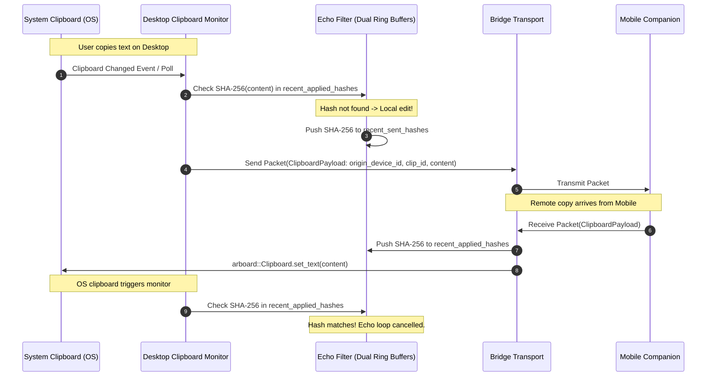

# Desktop Clipboard Sync Tool

The **Desktop Clipboard Sync Tool** integrates with the system clipboard to provide seamless bi-directional synchronization with mobile companions with automated echo cancellation.

---

## Architecture



---

## 1. Echo Cancellation & Provenance Tracking

To prevent infinite ping-pong feedback loops when synchronizing clipboards across companions:

### Dual Circular Hash Ring Buffers
`ClipboardEchoFilter` maintains two fixed-capacity circular buffers (capacity = 20):
1. **`recent_applied_hashes`**: Stores SHA-256 hashes of text received from remote peers and written to the local clipboard.
2. **`recent_sent_hashes`**: Stores SHA-256 hashes of local copies broadcast to peers.

### Broadcast Suppression
When the local system clipboard monitor detects changed text:
- Computes `hash = sha256(text)`.
- If `hash` exists in `recent_applied_hashes`, it was written by a remote peer; the event is dropped silently.
- Otherwise, `hash` is pushed to `recent_sent_hashes` and broadcast to connected peers.
- Single packet cap: payload text larger than 64 KB is dropped to avoid saturating Bluetooth serial links.

---

## 2. Wire Schema (`ClipboardPayload`)

```rust
pub struct ClipboardPayload {
    pub content: String,
    pub origin_device_id: String,
    pub clip_id: String,
}
```
