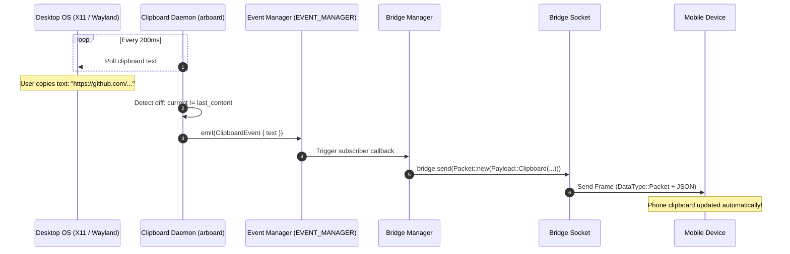

# Desktop Clipboard Sync Tool

The **Clipboard Sync Tool** enables bi-directional clipboard synchronization between your PC and mobile devices. Any text copied on your computer is instantly available to paste on your phone, and vice-versa.

---

## Architecture



---

## Implementation Details

### 1. Polling & Diff Detection ([`clipboard/mod.rs`](file:///home/kyete/kitchen/tools-ws/workspaces/main/tools-desktop-tauri/src-tauri/src/clipboard/mod.rs))
The desktop clipboard engine runs in an isolated `tokio` green thread:
- Employs the [`arboard`](https://crates.io/crates/arboard) crate for cross-platform access across Linux (Wayland & X11), Windows, and macOS.
- Polls at a calibrated **200ms interval**, striking an optimal balance between responsiveness and negligible CPU utilization.
- Stores `last_content: String` in memory to guarantee that duplicate events are never emitted.

### 2. Event Propagation ([`bridge_manager.rs`](file:///home/kyete/kitchen/tools-ws/workspaces/main/tools-desktop-tauri/src-tauri/src/bridge/bridge_manager.rs#L110-L125))
When a new device connects, `BridgeManager` attaches a listener to `EVENT_MANAGER`:

```rust
event_manager.on({
    let bridge = bridge.clone();
    move |event: ClipboardEvent| {
        let bridge = bridge.clone();
        async move {
            let packet = Packet::new(Payload::Clipboard(ClipboardPayload {
                content: event.text,
            }));
            bridge.lock().await.send(packet).await;
        }
    }
}).await;
```

### 3. Incoming Mobile Clipboard Packets
When the desktop receives a `Payload::Clipboard` packet from a connected mobile device:
1. The packet is recorded in `Bridge.packets`.
2. The payload text is written directly into the desktop system clipboard using `arboard`.
3. The clipboard daemon's `last_content` is synchronized to prevent echo loops back to the phone.

---

## Security & Privacy Considerations

- **Local Network Only**: Clipboard data is never routed through external servers or third-party cloud brokers.
- **Ephemerality**: Clipboard packets are transmitted in real time and can be excluded from persistent disk storage.
- **Future Controls**:
  - Whitelist/Blacklist for password managers (ignoring passwords copied from 1Password, Bitwarden, Keepass).
  - Configurable toggle to pause clipboard synchronization.
