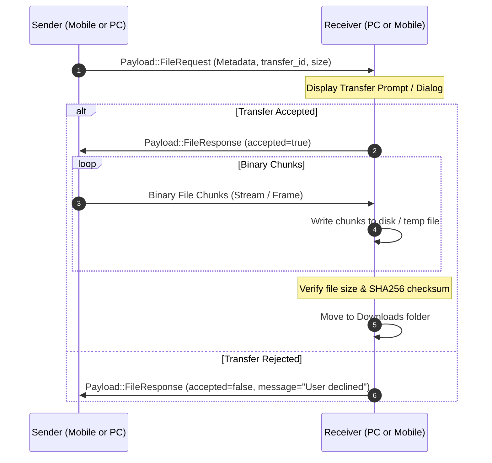

# Desktop File Transfer Tool

The **File Transfer Tool** enables direct peer-to-peer file sharing between your PC and mobile devices without file size limitations, bandwidth caps, or third-party cloud uploads.

---

## Protocol Workflow



---

## Packet Specifications

Defined in [`packets.rs`](file:///home/kyete/kitchen/tools-ws/workspaces/main/tools-desktop-tauri/src-tauri/src/bridge/packets.rs#L14-L29):

### 1. File Request ([`FileRequestPayload`](file:///home/kyete/kitchen/tools-ws/workspaces/main/tools-desktop-tauri/src-tauri/src/bridge/packets.rs#L14-L21))
Sent by the transferring device to request permission and prepare the receiver:
```rust
pub struct FileRequestPayload {
    pub file_name: String,      // e.g. "recording.mp4"
    pub file_size: u32,         // Total size in bytes
    pub mime_type: String,      // e.g. "video/mp4"
    pub transfer_mode: String,  // "stream" or "chunked"
    pub transfer_id: String,    // Unique UUID for the transfer
}
```

### 2. File Response ([`FileResponsePayload`](file:///home/kyete/kitchen/tools-ws/workspaces/main/tools-desktop-tauri/src-tauri/src/bridge/packets.rs#L23-L28))
Sent in reply by the receiving device:
```rust
pub struct FileResponsePayload {
    pub transfer_id: String,    // Corresponds to the FileRequest ID
    pub accepted: bool,         // true if approved, false if declined
    pub message: String,        // Status notes or decline reason
}
```

---

## Desktop Transfer Management

### Storage Location
- Received files are saved by default to the user's standard Downloads directory (`~/Downloads/Tools/` on Linux).
- Temporary chunks are accumulated in a `.part` staging file until transfer completion is verified.

### Transport Chunking Strategy
- **WebSocket**: Large chunk sizes (e.g. 64KB - 256KB) utilize high-throughput local network bandwidth.
- **Bluetooth RFCOMM**: Calibrated smaller chunk sizes (e.g. 4KB - 8KB) prevent buffer bloat and packet drops over serial RFCOMM connections.
- **Integrity**: Future iterations include SHA-256 integrity verification upon receiving the final chunk.
