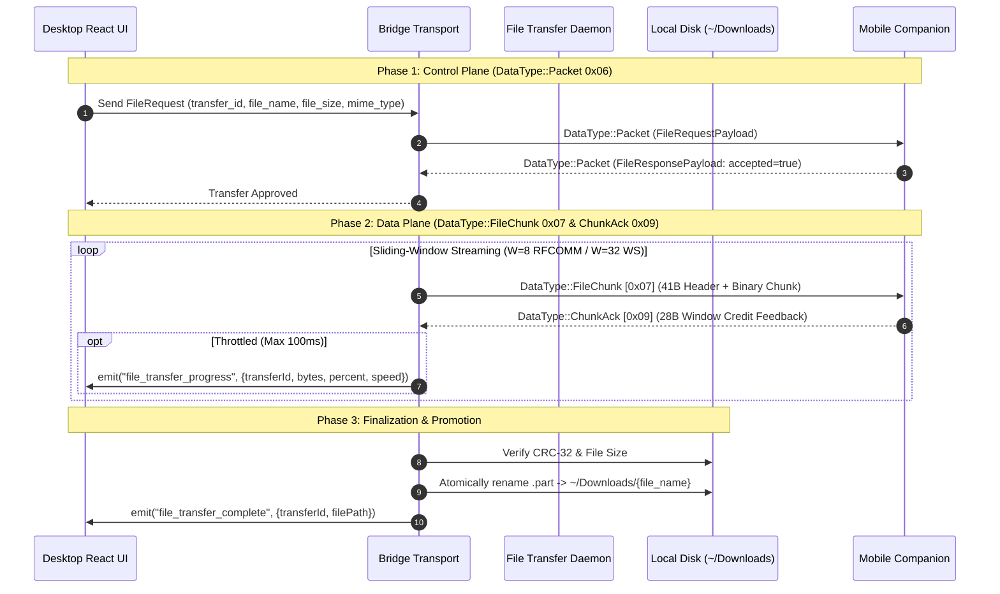

# Desktop File Transfer Tool

The **Desktop File Transfer Tool** provides high-throughput, memory-safe binary file exchanges with mobile companions over Bluetooth RFCOMM and LAN WebSockets without relying on third-party cloud services.

---

## Architecture

---

## 1. Split-Plane Architecture

1. **Control Plane (`DataType::Packet` [0x06])**:
   - Manages request/response negotiation (`FileRequestPayload` and `FileResponsePayload`), authentication verification, and user dialogs.
   - Bonded companions auto-accept transfers; untrusted peers prompt confirmation.
2. **Data Plane (`DataType::FileChunk` [0x07] & `ChunkAck` [0x09])**:
   - Operates directly on native socket threads (`socket.rs`).
   - Bypasses Tauri frontend IPC serialization, maintaining constant $O(1)$ memory usage (< 1.2 MB).

---

## 2. Sliding-Window Flow Control

To saturate available network bandwidth without overflowing serial Bluetooth buffers:
- **Bluetooth RFCOMM**: Window size $W = 8$ unacknowledged chunks (chunk size: 4 KB to 8 KB).
- **WebSocket (LAN)**: Window size $W = 32$ unacknowledged chunks (chunk size: 64 KB to 128 KB).
- The receiver replenishes window credits via `DataType::ChunkAck` (`0x09`) whenever in-flight credits fall to $\le W/2$.

---

## 3. Staging & Atomic File Promotion

- **Staging Location**: Incoming chunks are appended to a temporary file on the same filesystem:
  `~/Downloads/.tools_staging_{transfer_id}.part`.
- **Integrity Verification**: IEEE CRC-32 checksums are verified per chunk and across the total file on EOF (`CHUNK_FLAG_EOF`).
- **Atomic Promotion**: Upon successful EOF verification, the daemon atomically renames `.part` to `~/Downloads/{file_name}`. Failed or cancelled transfers remove the staging file immediately.
