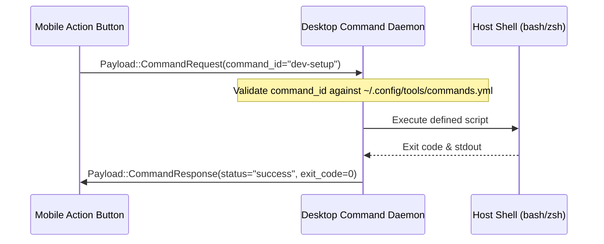

# Desktop Future Tools & Capabilities

This document formalizes the architecture and implementation specifications for planned tools within the Tools Desktop ecosystem, as established in the product vision.

---

## 1. Device Input & Media Control

### Overview
Transforms connected mobile devices into auxiliary input surfaces for the desktop (trackpad, media controller, macro pad).

### Technical Design
```mermaid
flowchart LR
    MobileTouch["Mobile Touch Events"] -->|Bridge (BT / WS)| InEngine["Desktop Input Engine"]
    InEngine -->|uinput / enigo| OS["Desktop OS (X11 / Wayland)"]
    
    DesktopMedia["MPRIS / Media Session"] -->|Event Bus| MediaServer["Desktop Media Server"]
    MediaServer -->|Bridge| MobileUI["Mobile Media Controls"]
```

- **Input Injection on Linux**: Uses the Linux `/dev/uinput` subsystem or virtual mouse/keyboard crates (`enigo`, `rdev`) to inject cursor movements, left/right clicks, and scrolling directly into the compositor (Hyprland / Sway / GNOME).
- **Media Control (MPRIS)**: Listens to MPRIS D-Bus interfaces (`org.mpris.MediaPlayer2`) on Linux to report playing track, album art, playback state, and forward commands (play, pause, next, volume adjustment).

---

## 2. Notification Mirroring & Quick Reply

### Overview
Synchronizes mobile notifications to the desktop desktop environment, enabling notifications to be read and dismissed without picking up the phone.

### Technical Design
- **Notification Daemon Hook**: Desktop listens for `Payload::Notification` frames from mobile.
- **Desktop Dispatch**: Emits system notifications using desktop D-Bus interfaces (`org.freedesktop.Notifications`) matching the user's desktop environment (compatible with `dunst`, `mako`, `swaync`, KDE, GNOME).
- **Action Callbacks**: Clicking "Reply" on a desktop notification creates an inline response sent back to mobile as a `Payload::NotificationAction`.

---

## 3. Remote Command Execution / Script Runner

### Overview
Allows executing custom scripts, launching development environments, or toggling system states on the PC directly from mobile quick-action buttons.

### Technical Design


- **Configuration**: Desktop maintains an explicit whitelist in YAML/JSON (e.g. `~/.config/tools/commands.yml`), mapping identifiers to commands:
  ```yaml
  commands:
    lock_screen:
      label: "Lock Screen"
      exec: "hyprlock"
    start_workspace:
      label: "Start Tools Workspace"
      exec: "tmux new-session -d -s tools"
  ```
- **Security Sandboxing**: Arbitrary shell execution is forbidden; only strictly whitelisted IDs can be executed.

---

## 4. Local Device Mesh

### Overview
Expands the Tools architecture from 1:1 client-server pairing to an ad-hoc local mesh of multiple desktops, laptops, and mobile devices.

### Technical Design
- **Decentralized Discovery**: Using mDNS/DNS-SD (Avahi / Bonjour) alongside Bluetooth LE advertisements for zero-configuration discovery across the entire local subnet.
- **Mesh Routing**: A desktop connected via Ethernet and Bluetooth can act as a bridge/relay for devices that cannot directly see each other.
- **Node Topology**: Each node maintains a routing table of known peer nodes, their connection latencies, and advertised capability sets.
