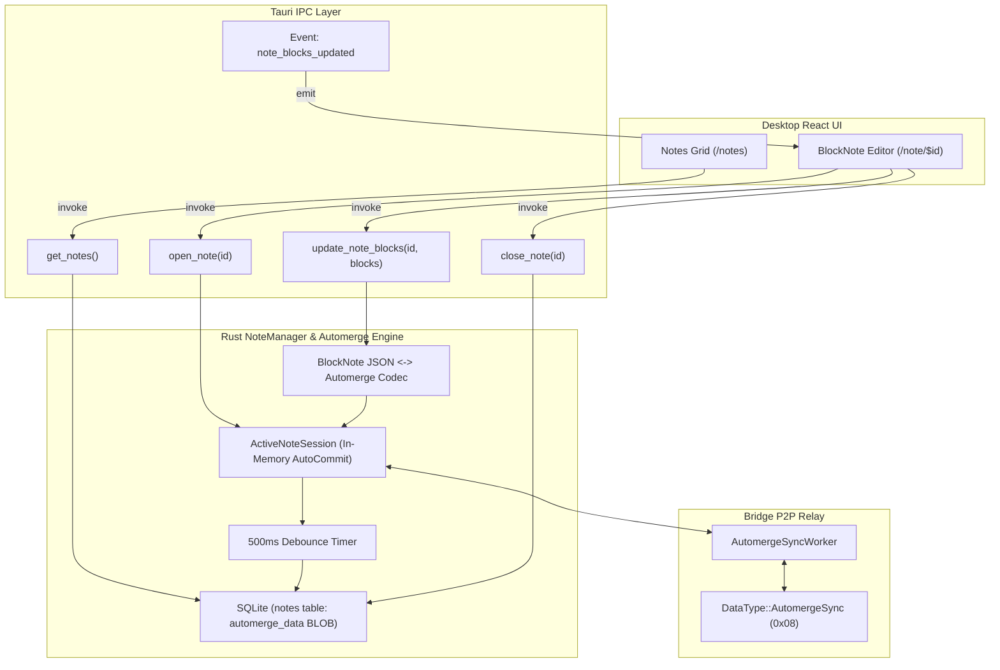

# Desktop Notes Tool

The **Desktop Notes Tool** provides a local-first, distraction-free rich-text editing experience powered by **Automerge CRDTs** and **BlockNote**, seamlessly synchronized across peer-to-peer companion devices without centralized servers.

---

## Architecture



---

## 1. Relational CRDT Document Model

Rather than storing raw ProseMirror steps, Automerge documents use a **normalized relational block schema**:

```
doc {
    block_order: List<String>,            // Root block UUID order
    blocks: Map<String, {                 // Map of all blocks by UUID
        id: String,
        type: String,                     // 'paragraph', 'heading', 'bulletListItem', etc.
        props: Map<String, Value>,        // Block properties (level, textColor, etc.)
        content: Text,                    // Automerge collaborative text sequence
        children: List<String>            // Child block UUIDs for nested lists/quotes
    }>
}
```

This representation eliminates block UUID collisions during concurrent edits and provides character-level conflict resolution inside block text contents.

---

## 2. In-Memory Lifecycle & Persistence

- **Active Note Session**: When the user opens a note, an `ActiveNoteSession` is held in memory with an `automerge::AutoCommit` document instance. Keystrokes mutate memory with sub-millisecond latency.
- **500ms Debounced Persistence**: Full document snapshots (`doc.save()`) are persisted to SQLite table `notes` only after 500ms of typing inactivity, protecting disk I/O.
- **Immediate Lifecycle Flush**: Closing a note or switching notes immediately cancels the timer and writes dirty state to disk.
- **Inactive Notes**: When remote `0x08 AutomergeSync` frames arrive for a note that is not open in the UI, the document is loaded from SQLite on demand, merged, saved, and dropped from memory immediately.

---

## 3. SQLite Storage Schema

```sql
CREATE TABLE IF NOT EXISTS notes (
    id TEXT PRIMARY KEY,
    title TEXT NOT NULL,
    snippet TEXT NOT NULL,
    automerge_data BLOB NOT NULL,
    created_at INTEGER NOT NULL,
    updated_at INTEGER NOT NULL
);
CREATE INDEX IF NOT EXISTS idx_notes_updated_at ON notes(updated_at DESC);
```

Instant queries for the note grid read `id`, `title`, `snippet`, and `updated_at` directly from index columns without deserializing Automerge documents.

---

## 4. Tauri IPC Commands

| Command | Arguments | Return Type | Description |
|---|---|---|---|
| `get_notes` | None | `Vec<NoteSummary>` | Returns metadata for all notes ordered by `updated_at DESC`. |
| `open_note` | `id: String` | `Vec<BlockNoteBlock>` | Loads document into active session and returns BlockNote JSON block tree. |
| `update_note_blocks`| `id: String, blocks: Vec<BlockNoteBlock>` | `()` | Diffs incoming block tree, mutates Automerge doc, resets 500ms debounce timer, and emits P2P deltas. |
| `close_note` | `id: String` | `()` | Flushes pending dirty state to SQLite and unloads active session from RAM. |

**Events**:
- `note_blocks_updated { id: String, blocks: Vec<BlockNoteBlock> }`: Emitted when external P2P sync modifies the currently active note in the UI.
