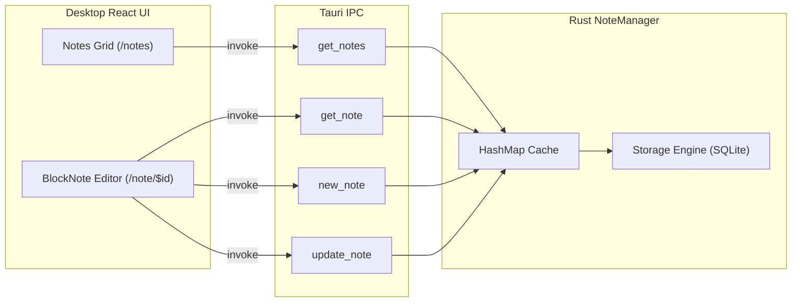

# Desktop Notes Tool

The **Notes Tool** provides a local-first, distraction-free rich-text editing experience seamlessly synchronized across your devices.

---

## Architecture



---

## Data Model

Notes are represented by the [`Note`](file:///home/kyete/kitchen/tools-ws/workspaces/main/tools-desktop-tauri/src-tauri/src/notes/mod.rs#L11-L16) struct in Rust:

```rust
pub type Document = String; // JSON string representing BlockNote block hierarchy

#[derive(Serialize, Deserialize, Debug, Clone)]
pub struct Note {
    pub id: String,
    store_id: Option<i64>,
    pub document: Document,
}
```

### Storage Mechanism
- The `Note` struct implements the `Storable` trait.
- Serialization is performed with **Postcard**, packing the note into a compact binary blob stored in SQLite table `Note`.
- Changes are immediately cached in `NoteManager.notes: HashMap<String, Note>` for instant in-memory read performance.

---

## Tauri IPC Commands

The Rust backend exposes the following IPC commands in [`lib.rs`](file:///home/kyete/kitchen/tools-ws/workspaces/main/tools-desktop-tauri/src-tauri/src/lib.rs#L80-L110):

| Command | Arguments | Return Type | Description |
|---|---|---|---|
| `get_notes` | None | `HashMap<String, Note>` | Fetches all notes from local storage. |
| `get_note` | `id: String` | `Note` | Fetches a single note by ID. |
| `new_note` | `doc: Option<Document>` | `Note` | Creates and persists a new note. |
| `update_note` | `id: String, doc: Document` | `Note` | Updates the document payload of an existing note. |

---

## User Interface

### 1. Note List & Masonry Grid ([`src/routes/notes.tsx`](file:///home/kyete/kitchen/tools-ws/workspaces/main/tools-desktop-tauri/src/routes/notes.tsx))
- **Masonry View**: Renders notes in a dynamic two-column responsive masonry layout.
- **HTML Previews**: Converts the stored JSON blocks into safe HTML previews on the fly using `editor.blocksToFullHTML()`.
- **Search Bar**: Quick-filtering input embedded into a translucent pill navbar.
- **Context Action Bar**: Right-clicking any note card triggers an action bar containing:
  - **Pin**: Pin notes to the top.
  - **Trash**: Soft delete / archive note.
  - **Tag**: Assign organizational labels.
  - **Copy**: Copy content to system clipboard.

### 2. Rich Text Editor ([`src/routes/note.{-$noteId}.tsx`](file:///home/kyete/kitchen/tools-ws/workspaces/main/tools-desktop-tauri/src/routes/note.{-$noteId}.tsx))
- Powered by `@blocknote/react` and `@blocknote/shadcn`.
- Supports slash commands, headings, bullet lists, checkable to-do items, code blocks, and block dragging.
- Auto-saves changes via `update_note` IPC calls.
