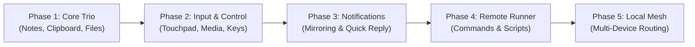

# Vision and Roadmap

## Mission Statement

**Tools** is an open-source, local-first ecosystem designed to bridge the boundary between your computer and mobile devices. It turns disparate personal hardware into a cohesive digital workspace without storing user data in the cloud or depending on third-party servers.

```
+-----------------------------------------------------------------------+
|                              T O O L S                                |
|   Local-First  *  Transport-Agnostic  *  Zero-Cloud  *  Modular Tools |
+-----------------------------------------------------------------------+
```

---

## Core Principles

1. **Local-First & Private by Design**: All synchronization, file exchange, and control commands remain strictly within local interfaces (Bluetooth RFCOMM, local Wi-Fi / LAN WebSockets). Your personal notes, files, and clipboard never touch external infrastructure.
2. **Transport Agnostic**: The Bridge abstraction treats any reliable duplex stream (Bluetooth, WebSocket, Wi-Fi Direct, serial, WebRTC) uniformly. Tools do not need to know which physical link is active.
3. **Frictionless Pairing & Resumption**: Connect by pointing your mobile camera at a desktop QR code. Reconnection is handled seamlessly through cryptographic session tokens without re-scanning.
4. **Ever-Evolving Modular Capabilities**: Tools is not just a single app; it is an extensible collection of capabilities ("Tools") sharing a common messaging fabric, local database layer, and event bus.
5. **Decentralized Local Mesh**: Moving beyond traditional master/slave or 1:1 pairing towards a multi-device local mesh where phones, tablets, and laptops discover and interoperate with each other.

---

## The Evolutionary Roadmap



### Phase 1: Core Trio (In Active Development)
- **Rich Notes Editor**: Block-based editor powered by BlockNote / Tiptap. Desktop stores notes in SQLite using Postcard binary serialization; Mobile uses WatermelonDB with reactive sync.
- **Bi-Directional Clipboard Sync**: Instant sync of copied text across devices with background polling (`arboard` on desktop, native clipboard listener on mobile).
- **Direct File Transfer**: Peer-to-peer file sharing protocol with confirmation dialogs, progress bars, and resumable chunks.

### Phase 2: Device Input & Media Control
- **Remote Touchpad**: Turn the mobile screen into a responsive multitouch trackpad for the desktop (two-finger scroll, tap-to-click, drag-and-drop).
- **Media Controller**: Control PC volume, play/pause, track skip, and view currently playing media metadata on mobile.
- **Virtual Numpad / Macro Deck**: Customizable touch shortcuts on mobile that trigger desktop keyboard shortcuts.

### Phase 3: Notification Mirroring
- **Cross-Device Alerts**: Forward mobile notifications (SMS, chat apps, system alerts) to desktop desktop notification daemons (e.g. `dunst`, `mako`, GNOME/KDE notification centers).
- **Actionable Responses**: Dismiss or send quick replies directly from desktop notification popups.

### Phase 4: Remote Command Execution
- **Script & Automation Runner**: Execute predefined shell scripts or system commands on PC triggered by a tap on mobile (e.g., lock screen, suspend, open terminal, launch workspace).
- **Security Sandboxing**: Strict whitelist configuration and token verification to ensure only authorized paired devices can trigger execution.

### Phase 5: Multi-Device Local Mesh
- **Beyond 1:1 Pairing**: Support topologies where one mobile device can connect to multiple desktops simultaneously, or multiple phones/tablets coordinate through a local desktop hub.
- **Mesh Packet Routing**: Bridging packets across devices that may not share a direct link (e.g., PC connected via Ethernet routes packets between two Bluetooth-connected devices).
